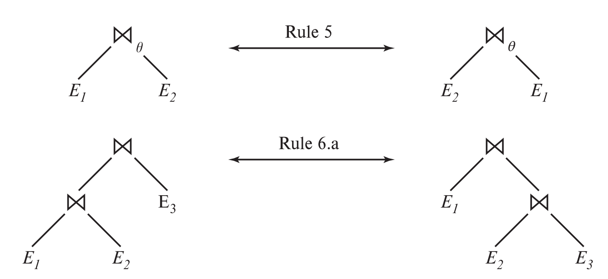
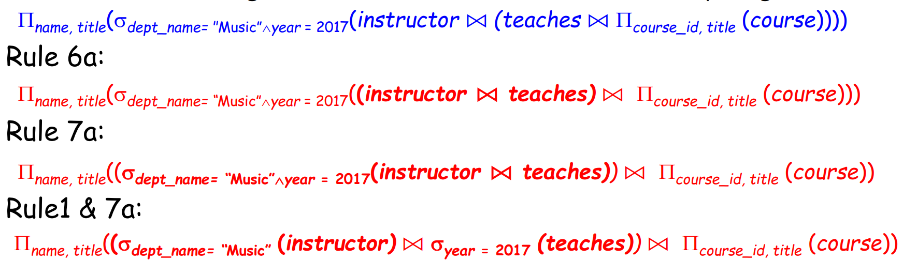
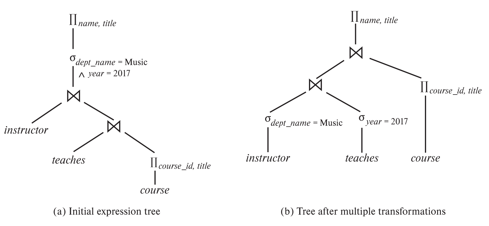
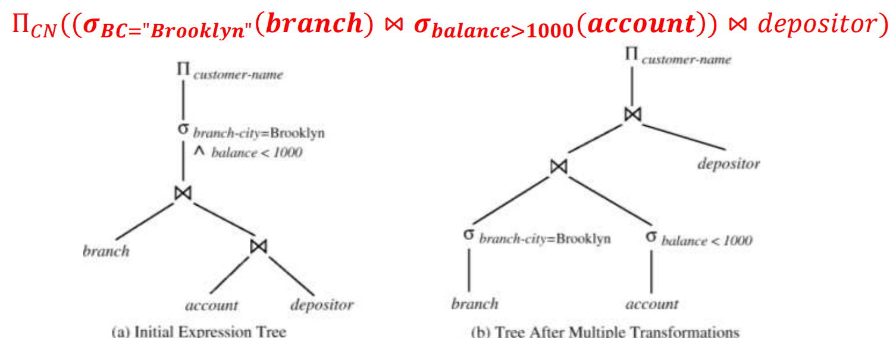
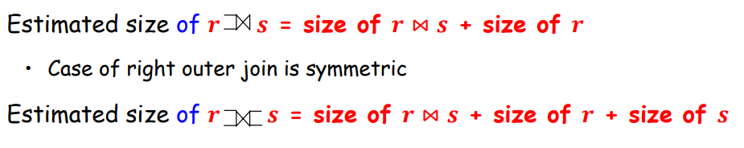

# Query Optimization

## Introduction

## Transformation of Relational Expressions

* Two relational algebra expressions are said to be equivalent if on every legal database instance the two expressions generate the same set of tuples
  * Note: order of tuples is irrelevant
* In SQL, inputs and outputs are multisets of tuples
* An equivalence rule says that expressions of two forms are equivalent
  * Can replace expression of first form by second, or vice versa

### Equivalent Rules

* Conjunctive selection operations can be deconstructed into a sequence of individual selections.(规则1：合取选择运算可分解为单个选择运算的序列)

    $\sigma_{\theta_1\wedge\theta_2}(E) = \sigma_{\theta_1}(\sigma_{\theta_2}(E))$

* Selection operations are commutative.(规则2：选择运算满足交换律)

    $\sigma_{\theta_1}(\sigma_{\theta_2}(E))=\sigma_{\theta_2}(\sigma_{\theta_1}(E))$

* Only the last in a sequence of projection operations is needed, the others can be omitted.（规则3：多个连续投影中只有最后一个运算是必需的，其余可忽略）

    $\Pi_{t_1}(\Pi_{t_2}(...(\Pi_{t_n}(E)))) = \Pi_{t_1}(E)$

* Selections can be combined with Cartesian products and theta joins.(规则4：选择操作可以与笛卡尔积以及𝜃连接相结合)

    $\sigma_\theta(E_1\times E_2) = E_1\bowtie_\theta E_2$

    $\sigma_{\theta_1}(E_1\bowtie_{\theta_2} E_2) = E_1\bowtie_{\theta_1\wedge\theta_2} E_2$

* Theta-join operations(and natural joins) are commutative.(规则5：𝜃连接满足交换律)
    $E_1\bowtie_\theta E_2 = E_2\bowtie_\theta E_1$

* Natural join operations are associative (规则6a：自然连接满足结合律)
    $(E_1\bowtie E_2)\bowtie E_3 = E_1\bowtie (E_2\bowtie E_3)$

* Theta joins are associative in the following manner, where $\theta_2$ involves attributes from only E2 and E3 (规则6b：𝜃连接满足下列方式的结合律，其中𝜃2只涉及E2和E3的属性)
    $(E_1\bowtie_{\theta_1}E_2)\bowtie_{\theta_2\wedge\theta_3} E_3 = E_1\bowtie_{\theta_1\wedge\theta_3}(E_2\bowtie_{\theta_2}E_3)$

    

* The selection operation distributes over the theta join operation under the following two conditions:
  * (a) When all the attributes in $\theta_0$ involve only the attributes of one of the expressions (E1) being joined. (规则7：选择操作在下面两个条件下对𝜃连接满足分配律，a. 当选择条件$\theta_0$中的所有属性只涉及参与连接的表达式之一(如E1)时)
    $\sigma_{\theta_0}(E_1\bowtie_\theta E_2) = (\sigma_{\theta_0}(E_1))\bowtie_\theta E_2$
  * (b) When $\theta_0$involves only the attributes of E1 and $\theta_2$ involves only the attributes of E2.(b. 当选择条件𝜃1只涉及𝐸1的属性，选择条件𝜃2只涉及𝐸2的属性时)
    $\sigma_{\theta_1\wedge\theta_2}(E_1\bowtie_\theta E_2) = (\sigma_{\theta_1}(E_1))\bowtie(\sigma_{\theta_2} (E_2))$

* The projections operation distributes over the theta join operation as follows:  
  * (a) if $\theta$ involves only attributes from $L_1\cup  L_2$ （规则8：令𝐿1、𝐿2分别代表𝐸1、𝐸1的属性子集，投影操作在下列条件下对𝜃连接满足分配律: a. 如果连接条件$\theta$只涉及$L_1\cup  L_2$中的属性）
    $\Pi_{L_1\cup L_2}(E_1\bowtie_\theta E_2) = (\Pi_{L_1}(E_1))\bowtie_\theta(\Pi_{L_2}(E_2))$
  * Consider a join $E_1\bowtie E_2$. Let L1 and L2 be sets of attributes from E1 and E2, respectively. Let L3 be attributes of E1that are involved in join condition $\theta$, but are not in $L_1\cup  L_2$, and let L4 be attributes of E2 that are involved in join condition $\theta$, but are not in $L_1\cup  L_2$. （b. 针对连接$E_1\bowtie E_2$，令𝐿3是𝐸1出现在连接条件𝜃中但不在$L_1\cup  L_2$中的属性，令𝐿4是𝐸2出现在连接条件𝜃中但不在$L_1\cup  L_2$中的属性）
    $\Pi_{L_1\cup L_2}(E_1\bowtie_\theta E_2) = \Pi_{L_1\cup L_2}((\Pi_{L_1\cup L_3}(E_1))\bowtie_\theta(\Pi_{L_2\cup L_4}(E_2)))$

  * Set union and intersection are commutative(set difference is not commutative).（规则9：集合的并和交满足交换律）

  * Set union and intersection are associative.（规则10：集合的并和交满足结合律）

  * Selection distributes over $\cup,\cap,-$. （规则11：选择操作对并、交、差满足分配率）

  * Projection distributes over union.（规则12：投影对并的分配律）

### Examples

* pushing selections
  * Find the names of all instructors in the Music department, along with the titles of the courses that they teach
    $\Pi_{name, title} (\sigma_{{dept\_name} = 'Music'} (instructor \bowtie (teaches \bowtie \Pi_{course\_id, title} (course))))$
  * Transformation using rule 7a
    $\Pi_{name, title} ((\sigma_{dept\_name = 'Music'} (instructor)) \bowtie (teaches \bowtie \Pi_{course\_id, title} (course)))$

* Multiple Transformations
  * Find the names of all instructors in the Music department who have taught a course in 2017, along with the titles of the courses that they taught
  
  
  

  * Find the names of all customers with an account at a Brooklyn branch whose account balance is over $1000

    * $\Pi_{CN}(\sigma_{BC="Brooklyn"\wedge balance>1000}(branch\bowtie(account\bowtie depositor)))$
    * CN: customer name, BC: branch city
  
  * Task: Give one equivalent expression with better execution performance

  * Performing the selection as early as possible reduces the size of the relation to be joined.

    

* Projection Operation
  * $\Pi_{CN}((\sigma_{BC = "Brooklyn"}(branch)\bowtie account) \bowtie depositor)$
  * when computing $(\sigma_{BC = "Brooklyn"}(branch)\bowtie account)$, we obtain a relation whose schema is:
  `(branch-name, branch-city, assets, account-number, balance)`
  * Push projections using equivalence rules 8a and 8b; eliminate unneeded attributes from intermediate results to get:
  $\Pi_{CN}(\Pi_{account_number}((\sigma_{BC = "Brooklyn"}(branch)\bowtie account)) \bowtie depositor)$

### Join Ordering

* For three relations 𝑟1, 𝑟2, and 𝑟3,
    𝑟1 ⋈ 𝑟2 ⋈ 𝑟3 = 𝑟1 ⋈ (𝑟2 ⋈ 𝑟3)

* If 𝑟2 ⋈ 𝑟3 is quite large and 𝑟1 ⋈ 𝑟2 is small, we choose
  𝑟1 ⋈ 𝑟2 ⋈ 𝑟3
  so that we can compute and store a smaller temporary relation

## Catalog Information for Cost Estimation

### Statistical Information for Relation

* 关系(表)的统计信息
  * $𝒏_𝒓$: the number of tuples in a relation 𝑟
  * $𝒃_𝒓$: the number of blocks of 𝑟
  * $𝒔_𝒓$: the size of a tuple of 𝑟
  * $𝒇_𝒓$: the blocking factor of 𝑟, i.e., the number of tuples that fit into one block
  * 𝑽(𝑨, 𝒓): the number of distinct values that appear in 𝑟 for attribute A, i.e., the size of $𝜫_𝑨(𝒓)$
  * SC(A, r): selection cardinality of attribute A of relation r; average number of records that satisfy equality on A.
  * If the tuples of r are stored together physically in a file, then $b_r= \lceil \frac{n_r}{f_r}\rceil$

### Catalog Information about Indices

* $𝑭_𝒊$: the average fan-out(扇出) of internal nodes of index 𝑖
  * for tree-structured indices such as B+-tree
* $𝑯𝑻_𝒊$: the number of levels in index 𝑖
  * i.e., the height of 𝑖
  * for a balanced tree index (such as B+-tree) on attribute A of relation 𝑟, $𝑯𝑻_𝒊 = \lceil𝒍𝒐𝒈_{𝑭_𝒊}(𝑽(𝑨, 𝒓))\rceil$ (其中𝑽(𝑨, 𝒓): the number of distinct values)
  * for a hash index, $𝐻𝑇_𝑖$ is 1
* $𝑳𝑩_𝒊$: the number of lowest-level index blocks in 𝑖
  * i.e., the number of blocks at the leaf level of the index

### Measures of Query Cost

* Recall that
  * Typically, disk access is the predominant cost, and is also relatively easy to be estimated
  * The number of block transfers from disk is used as a measure of the actual cost of evaluation
  * It is assumed that all transfers of blocks have the same cost
* Usually do not include the cost to write output to disk
* We refer to the cost estimate of algorithm A as $E_A$

### Simple Selection

* equality selection $\sigma_{A=a}(r)$
  * 假设取值均匀分布，则可估计选择结果有$𝒏_𝒓/𝑽(𝑨, 𝒓)$个元组
  * $SC(A, r)$ : number of records that will satisfy the selection
  * $\lceil SC(A, r)/fr\rceil$ : number of blocks that these records will occupy
  * E.g. Binary search cost estimate becomes
  $E_{a2} = \lceil log_2(b_r)\rceil + \lceil \frac{SC(A,r)}{f_r}\rceil-1$
  * Equality condition on a key attribute: $SC(A,r)= 1$

## Estimation of Statistics

### Complex Selection

* Selectivity (中选率) of a condition $𝜽_𝒊$
  * The probability that a tuple in the relation 𝑟 satisfies $𝜽_𝒊$
  * If $𝒔_𝒊$ is the number of tuples satisfying $𝜽_𝒊$, the selectivity of $𝜽_𝒊$ is given by $𝒔𝒊/𝒏_r$

* 合取 $\sigma_{\theta_1\wedge\theta_2\wedge...\wedge\theta_n}(r)$
  * estimated number of tuples:
    $n_r*\frac{s_1*s_2*...s_n}{n_r^n}$

* 析取 $\sigma_{\theta_1\vee\theta_2\vee...\vee\theta_n}(r)$
  * estimated number of tuples:
    $n_r*(1-\Pi_{i = 1}^{n}(1-\frac{s_i}{n_r}))$

* 取反 $\sigma_{\urcorner\theta}(r)$
  * estimated number of tuples:
    $n_r-size(\sigma_{\theta}(r))$

### Join

* Cartesian product
  * 𝒓 × 𝒔 contains $𝒏_𝒓 ∗ 𝒏_𝒔$ tuples
* Natural join
  * $R\cap S = \emptyset$, the same to $r\times s$
  * $R\cap S$ is a key for R, $size(r\bowtie s)\leq n_s$
  * $R\cap S$ is a foreign key in S referencing R, the number of tuples in $r\bowtie s$ is the same as the number of tuples in s

  * $R\cap S = \{A\}$ is not a key for R or S
    * If we assume that every tuple t in R produces tuples in $R\bowtie S$, the number of tuples in $R\bowtie S$ is estimated to be:
    $\frac{n_r*n_s}{V(A,s )}$

### Other

* projection
  $size(\Pi_A(r)) = V(A,r)$

* aggregation
  $size(~_Ag_F(r)) = V(A,r)$

* set
  * For unions/intersections of selections on the same relation: rewrite and use size estimate for selections
    * e.g. $\sigma_{\theta_1}(r)\cup\sigma_{\theta_2}(r) = \sigma_{\theta_1\vee\theta_2}(r)$
  * For operations on different relations:
    * $size(r\cup s) = size(r)+size(s)$
    * $size(r\cap s) = min(size(r),size(s))$
    * $size(r-s) = r$
    * the three estimates may be quite inaccurate, but provide upper bounds for the sizes

* outer join
  

## Dynamic Programming for Choosing Evaluation Plans
