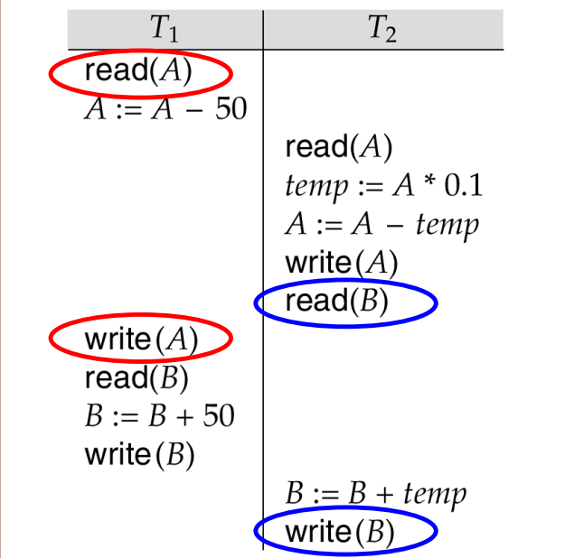

# Transaction Processing

## Transaction Concept

* A transaction (事务) is a unit of program execution consisting of multiple operations
  * During transaction execution, the database may be inconsistent
  * After the transaction is committed, the database must be consistent
* Two main issues
  * Concurrent execution of multiple transactions
  * Hardware failures and system crashes

### ACID Properties

* Atomicity（原子性）
  * Either all operations of the transaction are properly reflected in the database or none are
* Consistency（一致性）
  * Execution of a transaction in isolation preserves the consistency of the database
* Isolation（隔离性）
  * Although multiple transactions may execute concurrently, each transaction must be unaware of other transactions
* Durability（持久性）
  * After a transaction completes successfully, the changes it has made to the database persist, even if there are system failures

### Example of Fund Transfer

* A transaction to transfer $50 from account A to account B:
    1. read(A)
    2. A := A * 50
    3. write(A)
    4. read(B)
    5. B := B + 50
    6. write(B)

* Consistency requirement
  * The sum of A and B is unchanged by the execution of the transaction
* Atomicity requirement
  * If the transaction fails after step 3 and before step 6, the system should ensure that its updates are not reflected in the database. Otherwise, an inconsistency will occur
* Durability requirement
  * Once the user was notified that the transaction has completed, the updates to the database by the transaction must persist despite failures
* Isolation requirement
  * If between steps 3 and 6, another transaction is allowed to access the partially updated database, it will see an inconsistent database
  * Can be ensured trivially by running transactions serially, i.e., one after the other. However, executing multiple transactions concurrently has significant benefits

### Transaction State

* Active(活跃)
  * The initial state. The transaction stays in this state while it is executing
* Partially committed(部分提交)
  * After the final statement has been executed
* Failed(失败)
  * After discovering that normal execution can no longer proceed
* Aborted(夭折、中止)
  * After the transaction has been rolled back （回滚）and the database restored to its state prior to the start of the transaction
  * Restart the transaction
  * only if no internal logical error happens in the transaction
  * Kill the transaction
  * problems arising with the transaction, input data, no desirable data found in the database
* Committed(提交)
  * After successful completion

    

## Schedules

### Concurrent Executions

* Concurrent execution
  * Multiple transactions are allowed to run concurrently in the system
  * Advantages
    * Increase processor and disk utilization
    * Reduce average response time
* Concurrency control（并发控制）
  * Mechanisms to achieve isolation, i.e., to control the interaction among the concurrent transactions in order to prevent them from destroying the consistency of the database

* Schedule（调度）
  * sequences that indicate the chronological order （时间顺序）in which instructions of concurrent transactions are executed
  * a schedule for a set of transactions must consist of all instructions of those transactions
  * must preserve the order in which the instructions appear in each individual transaction.
* Example
  * Let 𝑻𝟏 transfer $50 from A to B, and 𝑻𝟐 transfer 10% of the balance from A to B
  * Schedule 1 is a serial schedule (串行调度), in which 𝑻𝟏 is followed by 𝑻𝟐
  

    

  * Non-serial schedule

    * Schedule 3 is not a serial schedule, but it is equivalent to Schedule 1
    

    * The following concurrent schedule does not preserve the value of the sum A + B.

    

## Serializable Schedule

### Serializability

* Assumption
  * Each transaction preserves database consistency, thus serial execution of a set of transactions preserves database consistency
* Serializability
  * A schedule is serializable if it is equivalent to a serial schedule
    * Conflict serializability（冲突可串行性）
    * View serializability（视图可串行性）
* Note
  * We ignore operations other than read and write instructions. Our simplified schedules consist of only read and write instructions

### Conflict Serializability

* conflict
  * Given instructions 𝑰𝒊 and 𝑰𝒋 of transactions 𝑻𝒊 and 𝑻𝒋 respectively, conflict occurs iff there exists some item Q accessed by both 𝑰𝒊 and 𝑰𝒋, and at least one of these instructions write Q
  * four cases
  

* Intuitively, a conflict between 𝑰𝒊 and 𝑰𝒋 forces a (logical) temporal order between them
* If 𝑰𝒊 and 𝑰𝒋 are consecutive in a schedule and they do not conflict, their results would remain the same even if they had been interchanged in the schedule

* Conflict equivalent
  * If a schedule 𝑺 can be transformed into a schedule 𝑺′ by a series of swaps of non-conflicting instructions, we say that 𝑺 and 𝑺′ are conflict equivalent
  * We say that a schedule 𝑺 is **conflict serializable** if it is conflict equivalent to a serial schedule
* Example of a schedule that is not conflict serializable
  * We are unable to swap instructions in the following schedule to obtain either the serial schedule <𝑻𝟑, 𝑻𝟒>, or the serial schedule <𝑻𝟒, 𝑻𝟑>.

  

  * example of conflict serializability

    

    

* A conflict serializable schedule is a serializable schedule, but a serializable schedule is not always conflict serializable

  

### View Serializability

* 𝑺 and 𝑺′ are view equivalent if the following three conditions are met:
  * For each data item Q, if transaction 𝑻𝒊 reads the initial value of Q in schedule S, then transaction 𝑻𝒊 must, in schedule 𝑺′, also read the initial value of Q.
  * For each data item Q, if transaction 𝑻𝒊 executes read(Q) in schedule S, and that value was produced by transaction 𝑻𝒋 (if any), then transaction 𝑻𝒊 must in schedule 𝑺′ also read the value of Q that was produced by transaction 𝑻𝒋.
  * For each data item Q, the transaction (if any) that performs the final write(Q) operation in schedule S must perform the final write(Q) operation in schedule 𝑺′

* As can be seen, view equivalence is also based purely on reads and writes alone.

* If a schedule S is view serializable, it is view equivalent to a serial schedule.
* Every conflict serializable schedule is also view serializable.
* A schedule which is view-serializable but not conflict serializable. Equivalent to $T_3,T_4,T_6$

  

* Every view serializable schedule that is not conflict serializable has blind writes - write without read

## Recoverable Schedule

## Testing for Serializability

* Precedence graph（优先图）
  * A direct graph where the vertices are the transactions
  * We draw an arc from 𝑻𝒊 to 𝑻𝒋 if the two transactions conflict, and 𝑻𝒊 accessed the data item on which the conflict arose earlier.
  * We label the arc by the data item that was accessed

* example
  
  

* A schedule is conflict serializable if and only if its precedence graph is acyclic（无环）

* If precedence graph is acyclic, the serializability order can be obtained by a topological sorting of the graph.

### Concurrency Control vs. Serializability Tests

* Testing a schedule for serializability after it has executed is too late
* Goal – to develop concurrency control protocols that will assure serializability.
  * They will generally not examine the precedence graph as it is being created
  * Instead a protocol will impose a discipline that avoids non-seralizable schedules
* Tests for serializability help understand why a concurrency control protocol is correct
