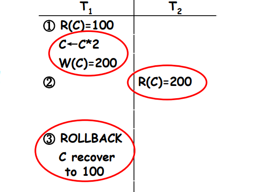

# Concurrency Control

## Concurrent Control

### Concurrent Control Problems

* problems caused by concurrent transactions
  * lost update
  * non-repeatable read
  * dirty read

* symbols
  * R(x): read x
  * W(x): write x

### Lost Update

* T1 and T2 read the same data item and modify it
* The committed result of T2 eliminates the update of T1

    

### Non-repeatable Read

### Dirty Read

## Lock-based Protocols(协议)

* A lock is a mechanism to control concurrent access to a data item
* Data items can be locked in two modes
  * exclusive (X) mode (排他型). Data item can be read and written. X-lock is requested using lock-X instruction
  * shared (S) mode (共享型). Data item can only be read. S-lock is requested using lock-S instruction
* Lock requests are made to concurrency control manager (并发控制管理器). Transaction can proceed only after the request is granted

