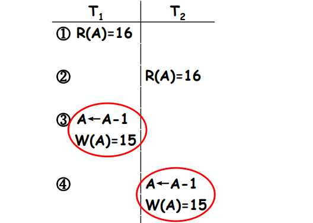

# Concurrency Control

## Concurrent Control

### Concurrent Control Problems

* problems caused by concurrent transactions
  * lost update
  * non-repeatable read
  * dirty read

* symbols
  * R(x): read x
  * W(x): write x

### Lost Update

* T1 and T2 read the same data item and modify it
* The committed result of T2 eliminates the update of T1

    

### Non-repeatable Read

### Dirty Read

## Lock-based Protocols(协议)

* A lock is a mechanism to control concurrent access to a data item
* Data items can be locked in two modes
  * exclusive (X) mode (排他型). Data item can be read and written. X-lock is requested using lock-X instruction
  * shared (S) mode (共享型). Data item can only be read. S-lock is requested using lock-S instruction
* Lock requests are made to concurrency control manager (并发控制管理器). Transaction can proceed only after the request is granted

* Lock-compatibility matrix (锁相容性矩阵)

  

* A transaction may be **granted a lock** on a data item if the requested lock is **compatible** with **locks already held on the data item** by other transactions.
* If a lock cannot be granted, the requesting transaction **waits** till all incompatible locks have been released. The lock is then granted.

* A locking protocol is a set of rules
  * followed by all transactions while requesting and releasing locks
  * locking protocols restrict the set of possible schedules

### Deadlock(死锁)

* consider the following partial schedule

  

* Such a situation is called a deadlock
  * To handle the deadlock, T3 or T4 must be rolled back and release its locks
  * Deadlock exists in most locking protocols

### Starvation (饥饿)

* E.g., a transaction may be waiting for an X-lock on a data item, while a sequence of other transactions request and are granted an S-lock on the same data item
* The same transaction is repeatedly rolled back due to deadlocks
* Concurrency control manager can be designed to prevent starvation

### Two-Phase Locking Protocol（两阶段加锁协议）

* 2PL is a protocol which ensures conflict-serializable schedules
  * Phase 1: Growing Phase (增长阶段)
    * transaction can obtain locks but cannot release locks
  * Phase 2: Shrinking Phase (缩减阶段）
    * transaction can release locks but cannot obtain locks
* The protocol **assures serializability**. It can be proved that the transactions can be serialized in the order of their **lock points (封锁点)**

* Satisfy 2PL
  Slock A Slock B Xlock C Unlock B Unlock A Unlock C；
  | ← G r o w i n g → | ..... | ← S h r i n k i n g → |
* Not satisfy 2PL
  Slock A **Unlock A** Slock B Xlock C Unlock C Unlock B；

* **cannot avoid deadlocks**

* **Cascading roll-back** is possible under two-phase locking
  * To avoid this, follow a modified protocol called **strict two-phase locking (严格两阶段封锁)**
  * A transaction must hold all its **exclusive locks** till it **commits**

* Rigorous two-phase locking (强两阶段封锁) is even stricter
  * all locks are held till commit/abort
  * transactions can be serialized in the order in which they commit

### Lock Conversions (锁转换)

* Two-phase locking with lock conversions
  * Upgrade (升级)
    * lock-S -> lock-X
  * Downgrade (降级)
    * lock-X -> lock-S
* This protocol **assures serializability**

### Automatic Acquisition of Locks

* A transaction 𝑻𝒊 issues the standard read/write instruction, without explicit locking calls

### Implementation of Locking

* Lock manager (锁管理器)
  * A lock manager can be implemented as a separate process to which transactions send lock and unlock requests
  * The lock manager replies to a lock request by sending a lock grant messages (or a message asking the transaction to roll back, in case of a deadlock)
  * The requesting transaction waits until its request is answered
  * The lock manager maintains a data-structure called a lock table (锁表) to record granted locks and pending requests

#### Lock Table

## Graph-based Protocols

* Graph-based protocols are an alternative to two-phase locking
  * Impose a **partial ordering →(偏序)** on the set 𝑫 = {𝒅𝟏, 𝒅𝟐, … , 𝒅𝒉} of all data items
  * If 𝒅𝒊 → 𝒅𝒋 then any transaction accessing both 𝒅𝒊 and 𝒅𝒋 must access 𝒅𝒊 before accessing 𝒅𝒋
  * Implies that the set D may now be viewed as a directed acyclic graph, called a database graph

* The **tree-protocol** is a simple kind of graph protocol.

### Tree Protocol

* Only exclusive locks are allowed
  * The first lock by 𝑻𝒊 may be on any data item
  * Subsequently, a data Q can be locked by 𝑻𝒊 only if the parent of Q is currently locked by 𝑻𝒊
  * Data items may be unlocked at any time
  * A data item cannot be relocked by 𝑻𝒊

* The tree protocol ensures conflict serializability as well as freedom from deadlock
* Unlocking may occur earlier than in the two-phase locking protocol-2PL
  * shorter waiting times, and increase in concurrency
  * protocol is **deadlock-free**, no rollbacks are required
  * the abort of a transaction can still lead to cascading rollbacks
* However, may have to lock data items that it does not access
  * increased locking overhead, and additional waiting time
  * potential decrease in concurrency

### Timestamp-based Protocols

## Multiple Granularity(多粒度)

## Deadlock Handling

* Deadlock prevention protocols ensure that the system will never enter into a deadlock state.
  * Require that each transaction locks all its data items before it begins execution (pre-declaration).
  * Impose partial ordering of all data items and require that a transaction can lock data items only in the order specified by the partial order (graph-based protocol).

