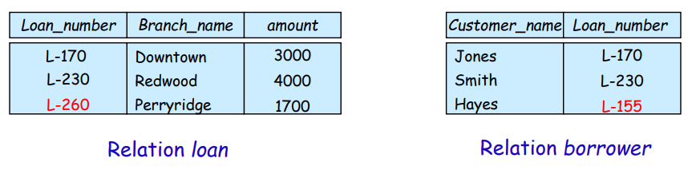
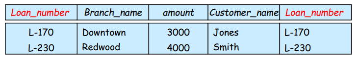
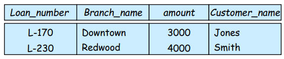
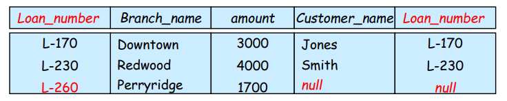
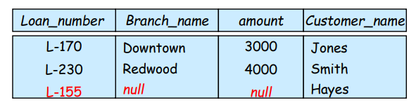
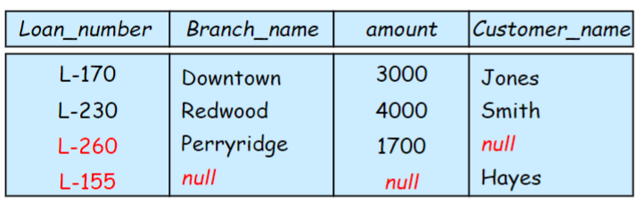
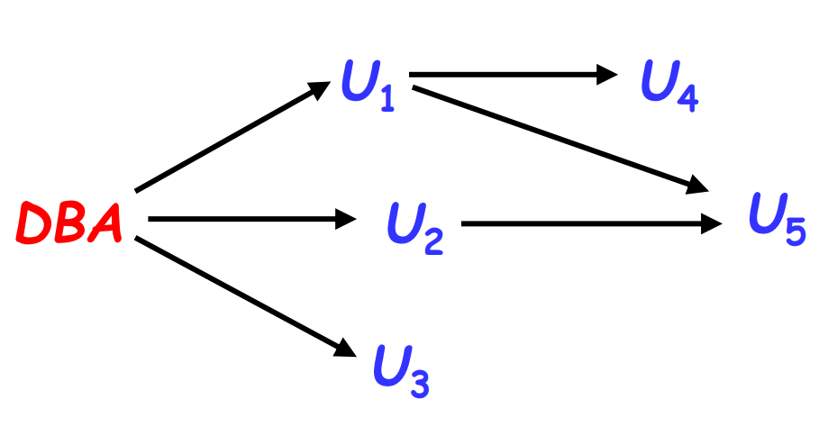

# Intermediate SQL

## Join Expressions

* the natural join

    ```sql
    select 𝐴1, 𝐴2,…, 𝐴𝑛
    from 𝑟1 natural join 𝑟2 natural join …natural join 𝑟𝑚
    where P;
    ```

* join operations
\- take two relations and return another relation as a result
* join type
  * inner join
  * left outer join
  * right outer join
  * full outer join
* join conditions
  * natural
  * on $<$predicate$>$
  * using $<A_1,A_2,\cdots,A_n>$

### Examples

* relation for examples
    

* borrower information is missing for L-260 and loan information is missing for L-155

* examples
  * inner join

    ```sql
    loan inner join borrower on
    loan.loan_number = borrower.loan_number
    ```

    

    ```sql
    loan natural inner join borrower
    ```

    

  * outer join

    ```sql
    loan left outer join borrower on
    loan.loan_number = borrower.loan_number
    ```

    

    ```sql
    loan natural right outer join borrower
    ```

    

    ```sql
    loan full outer join borrower using(loan_number)
    ```

    

### Differences

* on/using: using keep only one duplicated attribute
* on/where: in this case where cannot take the `outer join` effects

    ```sql
    -- on
    select *
    from student left outer join takes on student.ID=takes.ID

    -- where
    select *
    from student left outer join takes
    on true
    where student.ID=takes.ID
    ```

## Views

### View and View Updates

* Create a view of all loan data in relation loan, hiding the amount attribute

    ```sql
    create view branch_loan as
    select branch_name, loan_number
    from loan
    ```

* Add a new tuple to relation branch_loan

    ```sql
    insert into branch_loan
    values (‘Perryridge', ‘L-307')
    ```

* Updates on complex views are difficult or impossible to translate, and hence are disallowed

* Most SQL implementations allow updates only on simple views (without aggregates) defined on a single relation.

* In general, an SQL view is updatable if:
  * The **select** clause contains only attribute names of the relation, and does not have any **expressions, aggregates,** or **distinct specification**
  * Any **attributes** not listed in the select clause can be set to **null**
  * The **from** clause has only one relation
  * The query does **not** have a **group by** or **having** clause

### Materialized Views

* The relation of the view is stored
* Will change if the actual relations used in the view definition change. The view is kept up-to-date
* The aggregated result is likely to be much smaller than the large relations on which the view is defined; as a result, the materialized view can be used to answer the query very quickly, avoiding reading the large underlying relations. Of course, the benefits to queries from the materialization of a view must be weighed against the storage costs and the added overhead for updates.
* Materialized view maintenance
– Real-time updates vs. periodic updates
– Chapter 4 (Version 7)

## Transactions

* A transaction is a sequence of queries and update statements executed as a single unit (atomicity, 原子性)

* Transactions are started implicitly and terminated by one of
  * commit [work]: makes all updates of the transaction permanent in
the database
  * rollback [work]: undoes all updates performed by the transaction
  * [work] means ''work'' is optional

* In most database systems, each SQL statement that executes
successfully is automatically committed
  * Each transaction consists of only a single statement
  * Automatic commit can be turned off, allowing multi-statement
transactions, but depends on the database system
  * Another option in SQL:1999: enclose statements within

    ```sql
    begin atomic
    …
    end
    ```

## Integrity Constraints

* Types
  * Domain constraints -- check clause
  * Not null constraints
  * Unique constraint (form a **candidate key**(can be **null** if explicitly declared))
  * Referential integrity

  ```sql
  --referential
  create table person (
      ID char(10),
      name char(40),
      spouse char(10),
      primary key ID,
      foreign key spouse references person)
  ```

* Integrity Constraint Violation in Transactions

  ```sql
  --transactions like:
  insert into person
  value(123,Jack,Mary);
  insert into person
  value(333,Mary,Jack);
  ```

* this would cause violation after the first insertion, whatever the order

* To handle such situations, the SQL standard allows a clause **initially deferred** to be added to a constraint specification; the constraint would then be checked **at the end of a transaction**, and not at intermediate steps.

* A constraint can alternatively be specified as deferrable, which means it is checked immediately by default, but can be deferred when desired. For constraints declared as deferrable, executing a statement `set constraints constraint-list deferred` as part of a transaction causes the checking of the specified constraints to be deferred **to the end of that transaction**

* To avoid the violation above, we can:
  * Set spouse to null initially, update after inserting all persons (not possible if spouse attributes declared to be not null)
  * OR **defer constraint checking**

### Complex Check Clauses

Unfortunately: subquery in check clause or create assertion (断言) is not supported by many database systems
– Alternative: triggers (later)

### Database Modification

* r2's attribute set $\alpha$ reference r1 on attributes K

* Insert
  * If a tuple 𝒕𝟐 is inserted into 𝒓𝟐, the system must ensure that there is a tuple 𝒕𝟏 in 𝒓𝟏 such that 𝒕𝟏[𝑲] = 𝒕𝟐[𝜶]. That is 𝒕𝟐[𝜶] ∈ 𝜫𝑲(𝒓𝟏)

* Delete
  * If a tuple 𝒕𝟏 is deleted from 𝒓𝟏, the database system must compute the set of tuples in 𝒓𝟐 that reference 𝒕𝟏: $𝝈_{𝜶=𝒕𝟏[𝑲]} (𝒓𝟐)$
  * If this set is not empty
    * the update may be **rejected** as an error, or
    * the update may be **cascaded** to the tuples in the set, or
    * the tuples in the set may be **deleted**.

* Update
  * update in t2 is similar to the insert case
  * in t1, similar to the delete case

### Referential Integrity in SQL

* Short form for specifying a single column as foreign key

  ```sql
  account_number char (10) references account
  ```

#### Cascading Actions in Referential Integrity

```sql
create table course (
course_id char(5) primary key,
title varchar(20),
dept_name varchar(20) references department
);

create table course (
...
dept_name varchar(20),
foreign key (dept_name) references department
on delete cascade
on update cascade,
...
);
```

* Due to the on delete cascade clauses, if a delete of a tuple in department results in referential-integrity constraint violation, the delete "cascades" to the course relation, the tuples that refer to the department
that should be deleted

* Alternative to cascading
  * on delete set null
  * on delete set default
* Null values in foreign key attributes complicate SQL referential integrity semantics
  * if any attribute of a foreign key is null, the tuple is defined to satisfy the foreign key constraint

#### Assertion(断言)

* An assertion is a predicate expressing a condition that we wish the database always to satisfy

* An assertion in SQL take the form

  ```sql
  create assertion <assertion-name> check <predicate>
  ```

* When an assertion is made, the system tests it for validity, and tests it again **on every update** that may violate the assertion

## Data Types in SQL (Cont.)

### Built-in Data Types in SQL

* extract values of individual fields from date/time/timestamp, e.g.,

  ```sql
  extract (year from current_date)
  ```

* Can cast string types to date/time/timestamp, e.g.,

  ```sql
  cast <string-valued-expression> as time
  ```

### Default values

```sql
create table student(
  ID varchar(5),
  name varchar(20) not null,
  dept_name varchar(20),
  total_credit numeric(3,0) default 0,
)

insert into student(ID,name,dept_name)
    values('12345','Newman','Comp.Sci');
```

### Large-Object Values

* Large objects (photos, videos, CAD files, etc.) are stored as a large object

  * **blob**: binary large object - object is a large collection of uninterpreted binary data. The interpretation is left to an application outside of the database system
  * **clob**: character large object - object is a large collection of character data
  * e.g.

    ```sql
    book_review clob(10KB)
    image blob (10MB)
    movie blob(2GB)
    ```

  * When a query returns a large object, a **locator (pointer)** is returned rather than the large object itself

### User-Defined Types

* Create type construct in SQL creates user-defined type

  ```sql
  create type Dollars as numeric (12,2) [final]
  ```

* Create domain construct in SQL-92 creates user-defined domain types

  ```sql
  create domain person_name char(20) not null
  ```

* Types and domains are similar. Domains can have constraints, such as not null/default values, specified on them

  ```sql
  create domain degree_level varchar(10)
  constraint degree_level_test check (value in ('Bachelors', 'Masters', 'Doctorate'));
  ```

## Index Definition

* Many queries reference only a small proportion of the records in a table.
* It is inefficient for the system to read every record to find a record with particular value
* An index on an attribute of a relation is a data structure that allows the database system to find those tuples in the relation that have a specified value for that attribute efficiently, without scanning through all the tuples of the relation.
* We create an index with the create index command

  ```sql
  create index <name> on <relation-name> (attribute);
  ```

* Indices are data structures used to speed up access to records with specified values for index attributes

  ```sql
  select * 
  from student
  where ID = '12345'
  ```

  * Can be executed by using the index to find the required record, without looking at all records of relation student
  * More details on index in Chapter 14 (Version 7)(Binary tree, B+ tree, B tree, Hash…)

## Authorization

* Security
  * Database system level
  * Operating system level
  * Network level
  * Physical level
  * Human level

* Forms of authorization on **parts of** the database
  * read authorization
  * insert authorization
  * update authorization
  * delete authorization

* Forms of authorization to **modify** the database **schema**
  * index authorization
  * resources authorization
  * alternation authorization
  * drop authorization

* Authorization on views
  * users can have the authorization on **views** without authorization on the relations used in the view definition
  * a combination of relation-level security and view-level security can be used to limit a user's precisely access to the data that they need
  * Creation of a view does not require resources authorization since no real relation is being created
  * The creator of a view gets only those privileges that provide no additional authorization beyond that he already had
    * – E.g., if creator of view cust_loan had only read authorization on borrower and loan, he gets only read authorization on cust_loan

* Transfer/granting of privileges
  * the passage of authorization can be represented by **authorization graph**
    * nodes are the users
    * root is the database administrator
    * an edge $U_i\rightarrow U_j$ indicates that user $U_i$ has granted update authorization on loan yo $U_j$
    * e.g.
      
    * **requirement**: all edges in an authorization graph must be part of some path originating with the root
  * If DBA revokes grant from $U_1$:
    * Grant must be revoked from $U_4$ since $U_1$ no longer has authorization
    * Grant must not be revoked from $U_5$ since $U_5$has another authorization path from DBA through $U_2$
  * must prevent cycles of grants with no path from the root
  
  * The grant statement in SQL

    ```sql
    grant <privilege list>
    on <relation name / view name>
    to <user list>
    ```

    * userlist can be:
      * a user id
      * public (all valid users are granted)
      * a **role**
  * Granting a privilege on a view does not imply granting any privileges on the underlying relations
  * The grantor of the privilege must already hold the privilege on the specified item

  * Privilege in SQL
    * select
    * insert
    * update
    * delete
    * references
    * usage
    * all privileges

  * **with grant option**: allow a user who is granted on a privilege to pass it on to other users
    * e.g.

      ```sql
      grant select on branch to U1 with grant option
      ```

* Roles
  * **roles** permit common privileges for a class of users can be specified just once by creating a corresponding "role"
  * privileges can be granted to or revoke from roles
  * roles can be assigned to users, and even to other roles

  ```sql
  create role teller
  create role manager

  grant select on branch to teller
  grant update (balance) on account to teller
  grant all privileges on account to manager

  grant teller to manager
  grant teller to alice, bob
  grant manager to avi
  ```

* Revoking authorization in SQL

  ```sql
  revoke <privilege list>
  on <relation name or view name> from <user list> [restrict/cascade]
  ```

  * cascade: revocation of a privilege from a user may cause other users also to lose that privilege
  * restrict: with restrict, the revoke command fails if cascading revokes are required
  * privilege-list may be **all**
  * if revoke-list includes public, all users lose the privilege except those granted it explicitly
  * If the same privilege was granted twice to the same user by different grantees, the user may retain the privilege after the revocation
  * All privileges that depend on the privilege being revoked are also revoked
  
