# Database Design and E-R Model

## Overview of the Design Process

* Tasks involved in developing database application

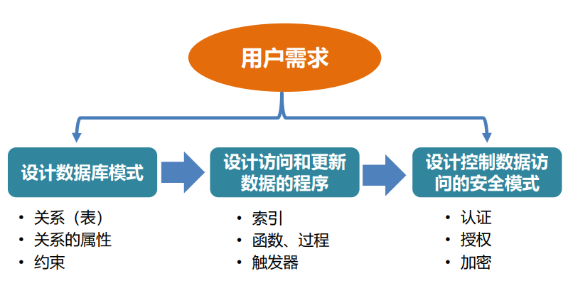

* Data Abstraction

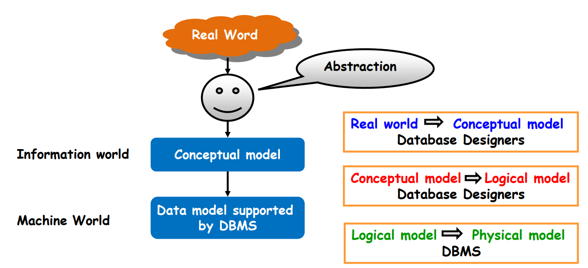

* Database Design

  * Conceptual design (概念设计)
    * Mapping a real world organization to a conceptual model
  * Logical design (逻辑设计)
    * Transforming the conceptual model to a logical model
  * Physical design (物理设计)
    * Instantiating the logical model to physical organization and storage

## Entity-Relationship Model

* E-R Diagrams in College

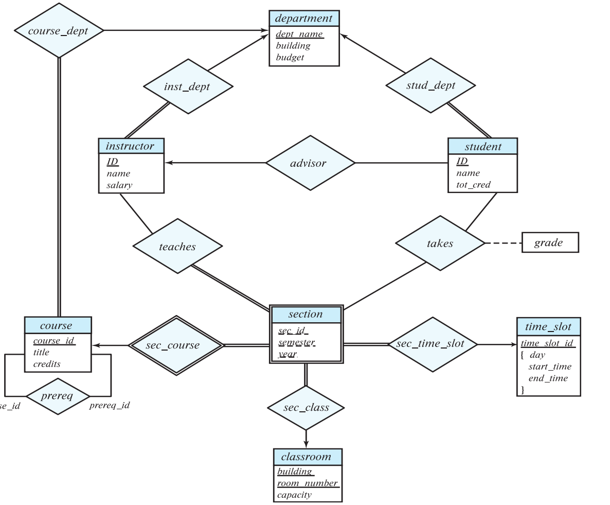

* A database ‘schema’ in the ER Model can be represented pictorially using **ER diagram**
* Can map an ER diagram into a relational schema

* three concepts of E-R Model
  * Entity set
  * Attributes
  * Relationship sets

### Entity sets

* A database can be modeled as
  * a collection of entities
  * relationship among entities

* An entity is an object that exists and is distinguishable from other objects
  * e.g. specific person, company, event...

* Entities have attributes

* An entity set is a set of entities of the same type that share the same properties

* Extension of the entity set is the actual collection of entities belonging to the entity set

### Attributes

* attribute types
  * simple and composite attributes
  * single-valued and multi-valued attributes
  * derived attributes

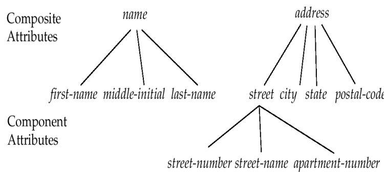

### Relational Sets

* a relationship is an association among several entities

* a relationship set is a mathematical relation among $n\geq2$ entities, each taken from entity sets $\{(e_1,e_2,\cdots,e_n)|e_1\in E_1,e_2\in E_2,\cdots,e_n\in E_n\}$
where $(e_1,e_2,\cdots,e_n)$ is a relationship

* relationship set borrower

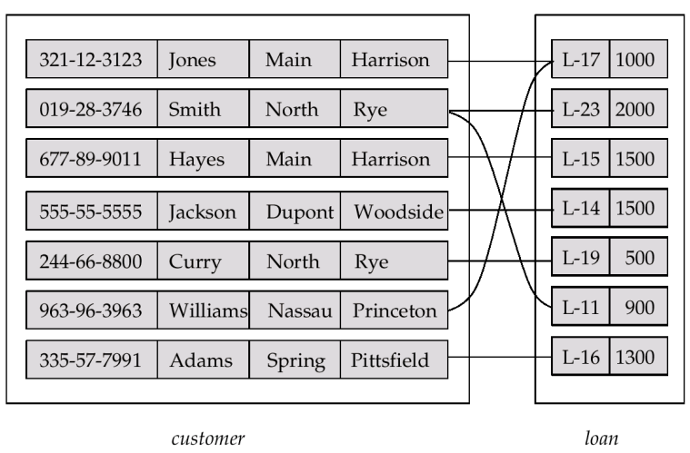

* an attribute can also be property of a relationship set

* the depositor relationship set between entity sets customer and account may have the attribute access-date

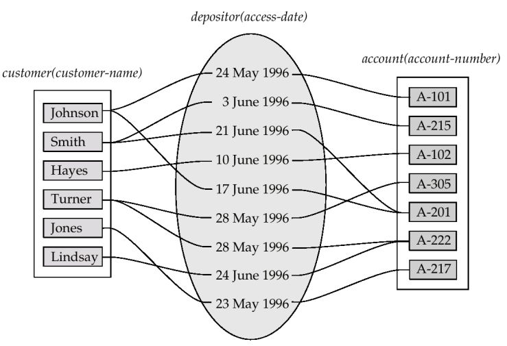

* degree of a relationship set
  * the number of entity sets that participate in a relational set
    * relationship sets that involve two entity sets are binary
    * most are binary

## Constraints

### Mapping Cardinalities

* For a binary relationship set, the mapping cardinality must be one of the following types:
  * one to one
  * one to many
  * many to one
  * many to many

* Note: some elements in A and B may not be mapped to any element in the other set

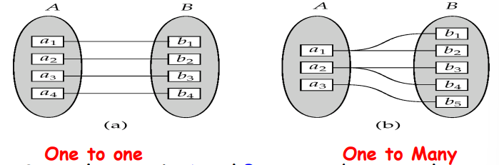

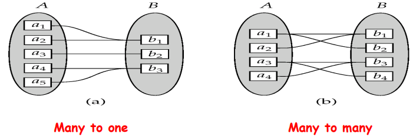

* mapping cardinalities affect ER design
  * Can make access-date an attribute of account, instead of a relationship attribute, if each account can have only one customer
  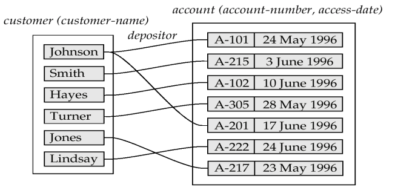

### Participation Constraints

* total participation  (indicated by double line)
  * Every entity in the entity set participates in at least one relationship in the relationship set
* partial participation

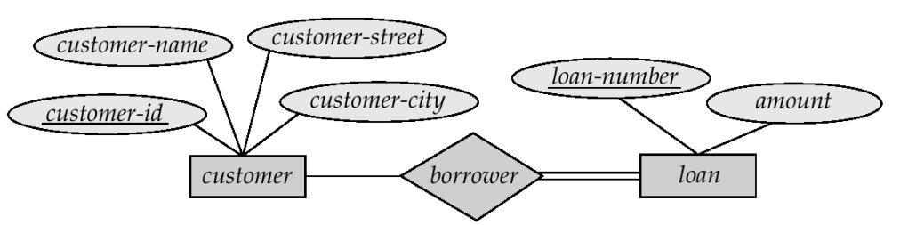

## E-R Diagrams

* Rectangles represent entity sets
* Diamonds represent relationship sets.
* Lines link attributes to entity sets and entity sets to relationship sets.
* Ellipses represent attributes
  * Double ellipses represent multi-valued attributes
  * Dashed ellipses denote derived attributes
* Underline indicates primary key attributes

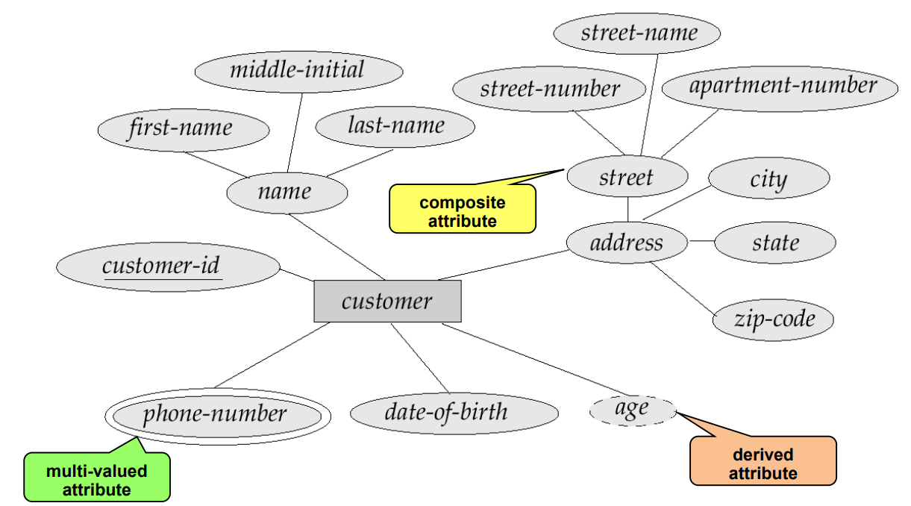

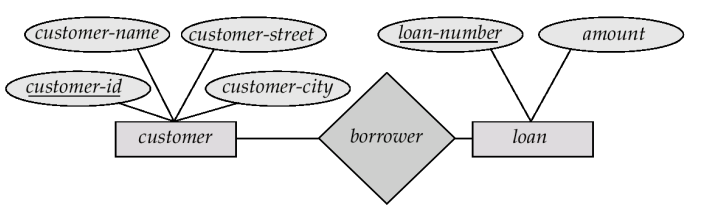

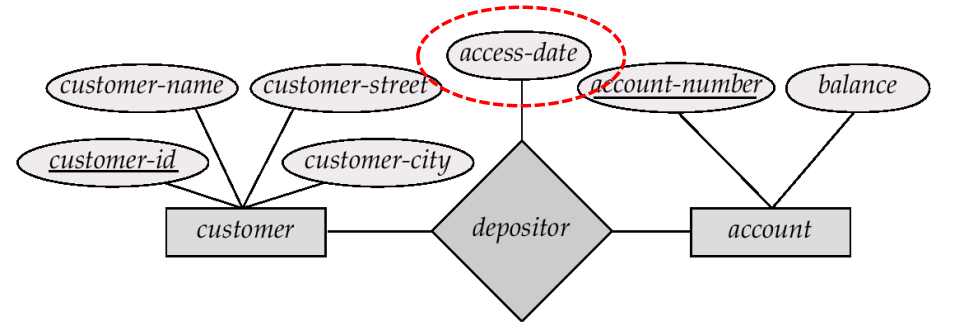

### Roles

* Entity sets of a relationship need not be distinct
– The labels “manager” and “worker” are called roles; they specify how employee entities interact via the works-for relationship set
– Role labels are optional and used to clarify semantics of the relationship

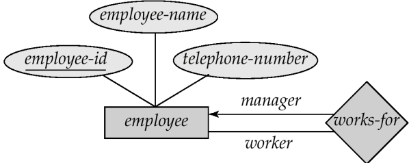

### Cardinality Constraints

* We express cardinality constraints by drawing either a directed line (→), signifying “one,” or an undirected line (—), signifying “many,” between the relationship set and the entity set.

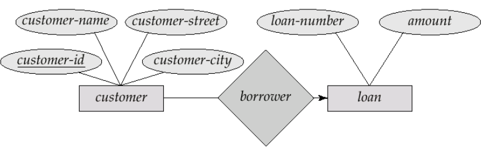

### Alternative Notation for Cardinality Limits

* Notation: 𝒎..𝒏, where 𝒎 and 𝒏 are the minimum and maximum cardinalities respectively
– m=0: each entity may not participate the relationship set (partial participation)
– m=1: each entity participates at least one relationship of the relationship set (full participation)
– n=1: each entity participates at most one relationship of the relationship set
– n=*: each entity participates many relationships of the relationship set

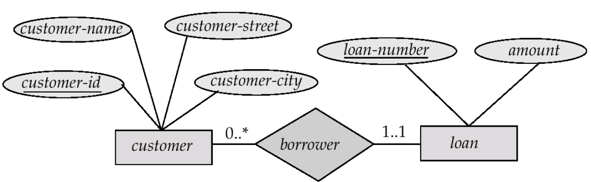

### Keys

* The concepts of superkey, candidate key, and primary key are applicable to entity sets just as they are applicable to relation schemas

#### Attributes for Relationship Sets

* Let R be a relationship set involving entity sets E1, E2,…, En. Let primary-key(Ei) denote the set of attributes that forms the primary key for entity set Ei. Assume all the primary-key(Ei) are unique
  * If the relationship set R has no attributes associated with it, then the set of attributes describes an individual relationship in set R

    $primary-key(E_1)\cup primary-key(E_2)\cup\cdots\cup primary-key(E_n)$
  * If the relationship set R has attributes a1, a2,…, am associated with it, then the set of attributes describes an individual relationship in set R

    $primary-key(E_1)\cup primary-key(E_2)\cup\cdots\cup primary-key(E_n)\cup\{a_1,a_2,\cdots,a_m\}$

  * If the attribute names of primary keys are not unique across entity sets, the attributes are renamed to distinguish them

#### Keys for Relationship Sets

* The combination of primary keys of the participating entity sets forms a super key of a relationship set
* Must consider the mapping cardinality of the relationship set when deciding what are the candidate keys
* Need to consider **semantics(语义)** of relationship set in selecting the primary key in case of more than one candidate key

* consider **binary relationships**
  * For many-to-many relationships, the preceding union of the primary keys is a minimal superkey and is chosen as the primary key
  * For one-to-many and many-to-one relationships, the primary key of the "many" side is a minimal superkey and is used as the primary key

* nonbinary relationships(omitted)

  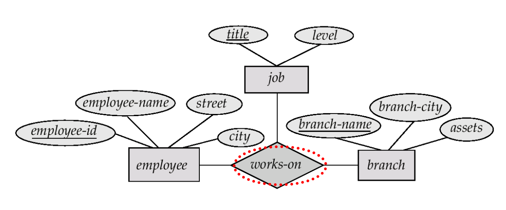

### Binary vs. Non-Binary Relationships

* Some relationships that appear to be non-binary may be better represented using binary relationships
  * E.g. A ternary relationship parents, relating a child to his/her father and mother, is best replaced by two binary relationships, father and mother
    * Using two binary relationships allows partial information (e.g. only mother being know)
  * But there are some relationships that are naturally non-binary
    * E.g. works-on

### Converting Non-Binary Relationships

* In general, any non-binary relationship can be represented using binary relationships by **creating an artificial entity set**

  * Replace R between entity sets A, B and C by an entity set E, and three relationship sets:
    * RA, relating E and A
    * RB, relating E and B
    * RC, relating E and C
  * Create a special identifying attribute for E, and add any attributes of R to E
  * For each relationship (𝒂𝒊 , 𝒃𝒊 , 𝒄𝒊) in R, create
  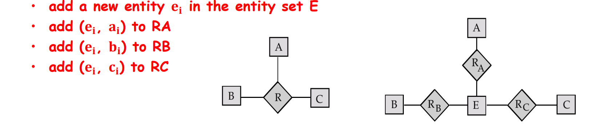
  * We can avoid creating an identifying attribute by making E a **weak entity set** (described shortly) identified by the three relationship sets

### Weak Entity Sets（弱实体集）

* An entity set that does **not have a primary key** is referred to as a **weak entity set**

* The existence of a weak entity set depends on the existence of an **identifying entity set（标识主体集）**
  * Identifying relationship depicted using a double diamond

* **discriminator(partial key,分辨符)**
* The primary key of a weak entity set
  * Discriminator plus primary keys of identifying entity sets

* Depict a weak entity set by double rectangles.
* Underline the discriminator (分辨符) of a weak entity set with a dashed line.(虚线)

* e.g.

  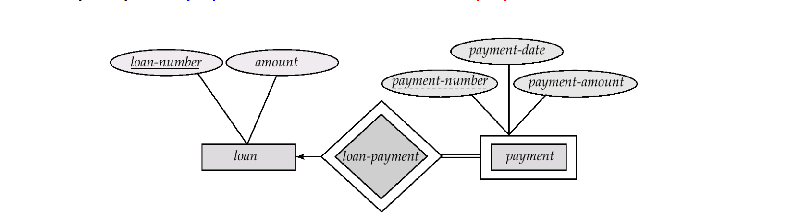

* Note: the primary key of the strong entity set is not explicitly stored with the weak entity set, since it is implicit in the identifying relationship.

### ER Design Issues

* Use of entity sets vs. attributes
  * depends on **structure,semantics**
* Use of entity sets vs. relationship sets
* Binary versus n-ary relationship sets

### Specialization(特化)

* Top-down design process (自上而下的设计过程)
  * subgroupings become lower-level entity sets that have attributes or participate in relationships that do not apply to the higher-level entity set
  * Depicted by a triangle component labeled ISA, e.g., customer “is a” person

* Attribute inheritance（属性继承）
  * A lower-level entity set inherits all the attributes and relationship participation of the higher-level entity set to which it is linked

  

### Generalization（泛化）

* A bottom-up design process (自下而上的设计过程)

* **Specialization (特化), Generalization (泛化)** are represented in the same way in an E-R diagram

* The ISA relationship also referred to as superclass - subclass relationship

#### Design Constraints on a Specialization/Generalization

* onstraint on which entities can be members of a given lower-level entity set
  * condition-defined (attribute-defined)
  * user-defined
* Constraint on whether or not entities may belong to more than one lower-level entity set within a single generalization
  * Disjoint
  * Overlapping
* Completeness constraint - specifies whether or not an entity in the higher-level entity set must belong to at least one of the lower-level entity sets within a generalization
* total
* partial

### Aggregation(聚合)

* Eliminate this redundancy via aggregation
  * Treat relationship as an abstract entity
  * Allows relationships between relationships

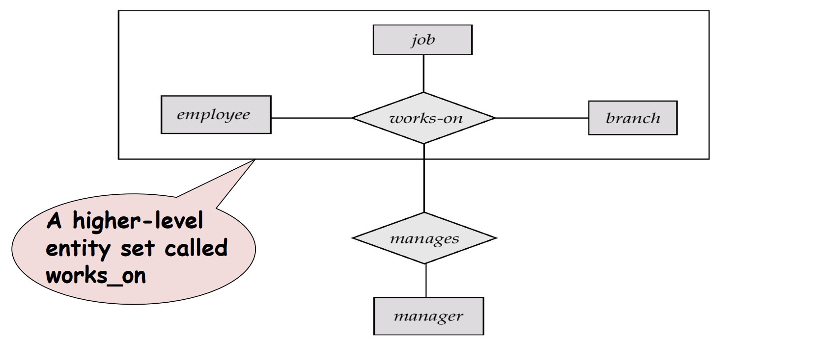

### Summary of Symbols Used in E-R Notation

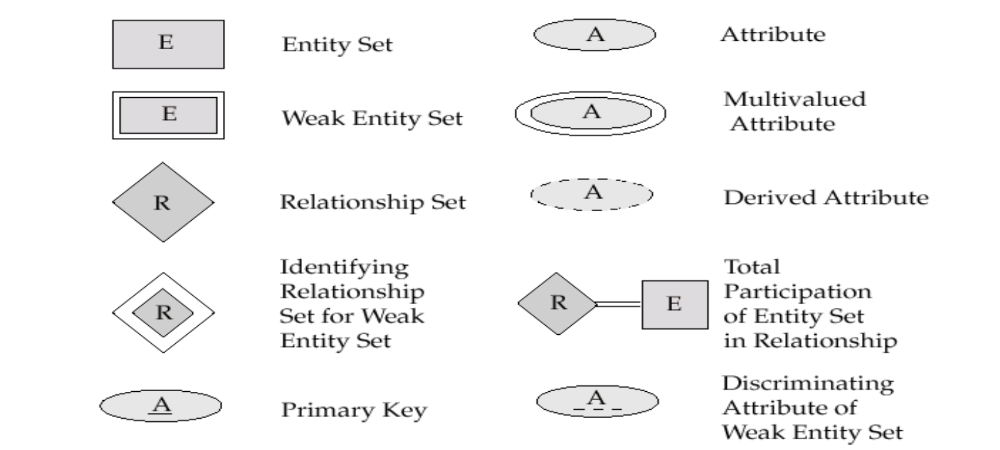

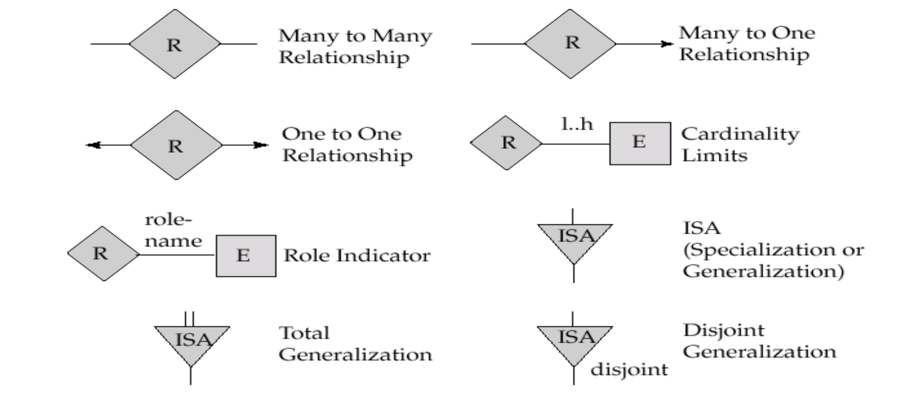

## Reduction to Relation Schemas

* Reduction of an E-R Diagram to Tables
  * For each entity set and relationship set there is a unique table.
  * Each table has a number of columns
  * Converting an E-R diagram to a table format is the basis for deriving a relational database design from an E-R diagram
* Primary keys allow entity sets and relationship sets to be expressed uniformly as tables which represent the contents of the database

---

### Composite and Multi-valued Attributes

* **Composite attributes** are flattened out by creating a separate attribute for each component attribute
* A multi-valued attribute M of an entity E is represented by a separate table EM

---

* A **weak entity** set becomes a table that includes a column for the primary key of the identifying strong entity set

---

### Representing Specialization as Tables

* method1
  * Form a table for the higher level entity
  * Form a table for each lower level entity set, include primary key of higher level entity set and local attributes
* method2
  * Form a table for each entity set with all local and inherited attributes
  * If **specialization is total**, table for generalized entity (person) not required to store information

---

### Relations Corresponding to Aggregation

* To represent aggregation, create a table containing
  * primary key of the aggregated relationship,
  * the primary key of the associated entity set
  * Any descriptive attributes

---

## Summary
