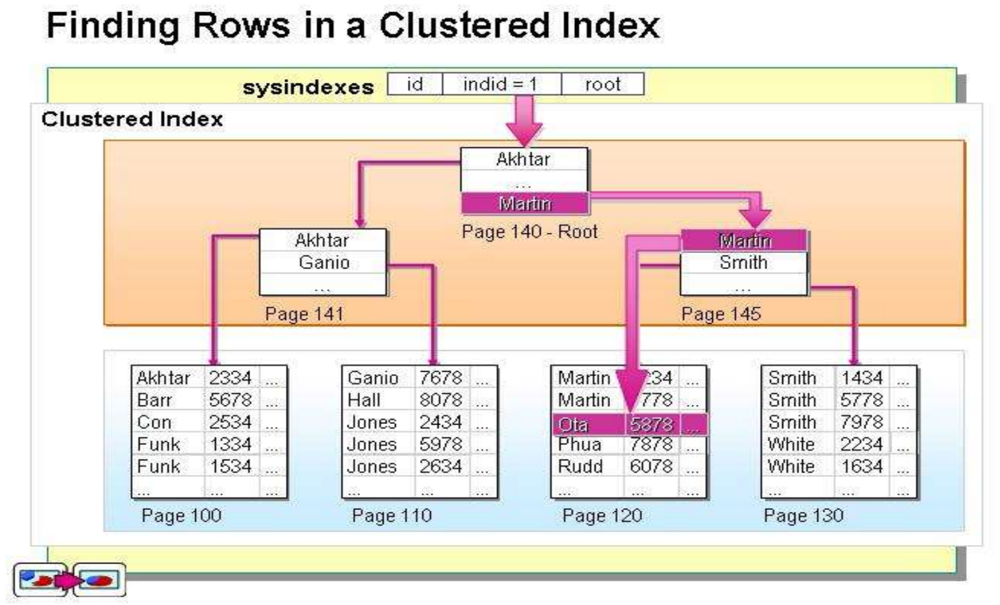
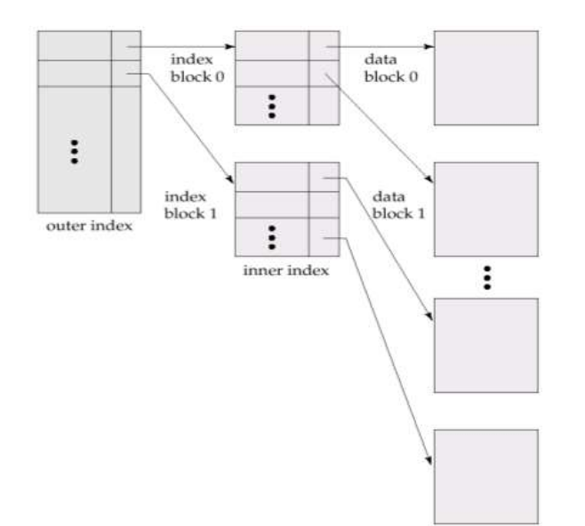
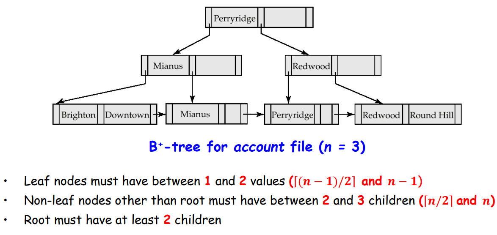
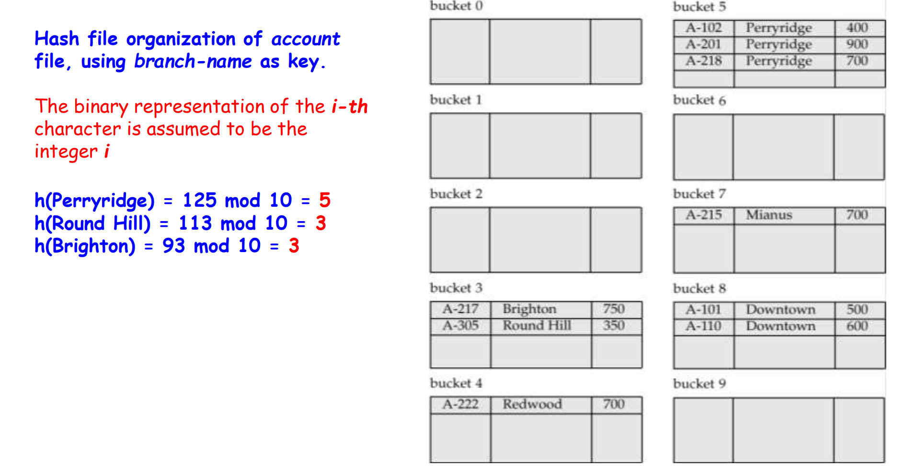
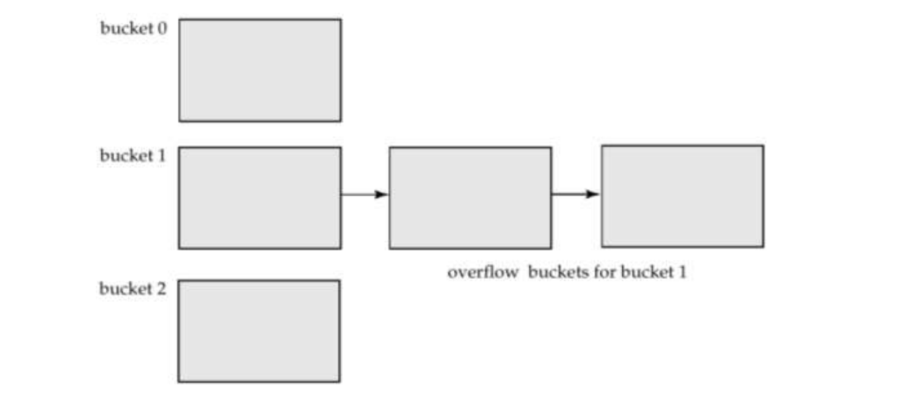
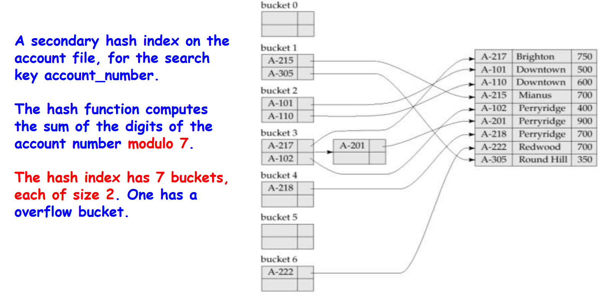

# Indexing & Hashing

## Basic Concepts

* Query
* **Indexes** (索引) are a kind of data structures for speeding up query processing
* Indexing mechanisms
  * speed up the access of desired data
  * index files are typically much smaller than the original file
* **Search Key**(搜索码/关键字)
  * The set of attributes used to look up records in a file/table
  * An index file consists of records (called index entries, 索引项) of the form (search-key, pointer)
* Two kinds of indices
  * **Ordered index** (顺序索引): search keys are stored in sorted order
  * **Hash index** (散列索引): search keys are distributed uniformly across "buckets" using a "hash function"
* Why indexes work?
  索引可提高检索效率，其结构（二叉树、B+树等）占用空间小，所以访问速度快
  * 如果表中的一条记录在磁盘上占用 1000字节，对其中10字节的一个字段建立索引，那么该记录对应的索引项的大小只有10字节。如SQL Server的最小空间分配单元是"页Page"，一个页在磁盘上占用8K空间，可以存储上述记录8条，但可以存储索引800条
  * 从一个有8000条记录表中检索符合某个条件的记录，如没有索引，可能需要遍历8000条×1000字节/8K字节=1000个页面才能找到结果。
  * 如果在检索字段上有上述索引，则可以在8000条×10字节/8K字节=10个页面中检索到满足条件的索引块（可以放在内存中），然后根据索引块上的指针逐一找到结果数据块，这样I/O访问量要少很多
* Index evaluation metrixs
  * access types supported efficiently
    * e.g. equal-query,range-query,...
  * access time
  * update time
    * insertion time
    * deletion time
  * space overhead

## Ordering Indexing

* ordered index
  * index entries are sorted on the search key value
  * primary index and secondary index
  * **Primary index (主索引), clustering index 聚集索引**
    * 包含记录的文件按某个搜索码指定的顺序排序，该搜索码对应的索引称为clustering index
  * **Secondary index (辅助索引), no-clustering index (非聚集索引)**
    * An index whose search key specifies an order different from the sequential order of the file
* Index-sequential file (索引顺序文件)
  * Ordered sequential file with a primary index
  * 索引顺序文件是顺序文件的扩展，其中各记录本身在介质上也是顺序排列的，包含了直接处理和修改记录的能力。索引顺序文件能像顺序文件一样进行快速顺序处理，既允许按物理存放次序（记录出现的次序），也允许按逻辑顺序（由记录主关键字决定的次序）进行处理。索引顺序文件通常用树结构来组织索引。静态索引结构ISAM和动态索引结构VSAM

### primary index: clustering index

* 聚集索引的叶节点就是数据节点，索引顺序就是数据物理存储顺序。一个表最多只能有一个聚集索引


### secondary index: non-clustering index

* 非聚集索引的叶节点仍然是索引节点，有一个指针指向对应的数据块。
  非聚集索引顺序与数据物理排列顺序无关

---

* dense index
  * Index record appears for every search-key value in the file
* sparse index
  * Contain index records for only some search-key values when records are sequentially ordered on search-key (why?)
* multilevel index
  * If primary index does not fit in memory, data access becomes expensive
  * To reduce the number of disk accesses to index records, treat primary index as a sequential file and construct a sparse index on it
    * outer index – a sparse index of primary index
    * inner index – the primary index file
  * If even outer index is too large to fit in main memory, yet another level of index can be created, and so on
  

### dense vs. sparse index

* to locate a record with search-key value K
  * dense
    * find index record with search-key value = K
  * sparse
    * find index record with the largest search-key value <= K
    * then search file sequentially starting at where the index points to
* index update
  * deletion
    * dense indices - similar to file record deletion
    * sparse indices
      * if an entry for the search key exists in the index, it is deleted by replacing the entry in the index with the next search-key value in the file
      * if the next search-key value already has an index entry, the entry is deleted instead of being replaced
  * insertion
    * Perform a lookup using the search-key value
    * Dense indices – if the search-key value does not appear in the index, insert it
    * Sparse indices – if index stores an entry for each block of the file, no change needs to be made to the index unless a new block is created. In this case, the first search-key value appearing in the new block is inserted into the index

* space and maintenance
  * Sparse index needs less space and less maintenance overhead for insertions and deletions
  * Good tradeoff: sparse index with an index entry for every block in file, corresponding to the least search-key value in the block

### Secondary Indices

* Querying by secondary indices
  * Example 1: In the account relation stored sequentially by account number, we may want to find all accounts in a particular branch
  * Example 2: to find all accounts with a specified balance or range of balances
* Secondary index
  * Build a secondary index with an index record for each search-key value
  * Index record points to a bucket that contains pointers to all the actual records with that particular search-key value
  

### Primary & Secondary Indices

* Secondary indices have to be **dense**
* When a file is modified, every index on the file must be updated. Updating indices imposes overhead on database modification
* Sequential scan using primary index is efficient, but a sequential scan using a secondary index is expensive
  * each record access may fetch a new block from disk

## B+-tree & B-tree Indices

* disadvantage of indexed-sequential file
  * Performance degrades as file grows, since many overflow blocks (溢出块) get created. Periodic reorganization of entire file is required

### B+-tree Index File

* B+-tree index file
  * Advantage: automatically reorganizes itself with small and local changes, in the face of insertions and deletions. Reorganization of entire file is not required to maintain performance
  * Disadvantage: extra insertion and deletion overhead, space overhead
  * B+-tree is used widely since its advantages outweight the disadvantages

  

* typical B+-tree node

  

  * $K_i$: search-key values. They are ordered in a node, i.e. $K_1<K_2<...<K_{n-1}$
  * $P_i$: pointers to children (non-leaf nodes) or pointers to records or buckets of records(leaf nodes)

* A B+-tree is a rooted tree (有根树) satisfying the following properties:
  * B+-tree is a balanced tree and all the paths from root to leaf nodes are of the same length
  * Internal node
    * Each node has between $\lceil n/2\rceil$ and $n$ children (pointers)
  * Leaf node
    * Each node has between $\lceil (n-1)/2\rceil$ and $n-1$ values
  * Root node
    * If the root is not a leaf, it has at least $2$ children
    * If the root is a leaf (i.e., there are no other nodes in the tree), it can have between $0$ and $n–1$ values

    

### Leaf Node in B+-tree


* Properties of a leaf node
  * Pointer $P_i$ either points to a file record with search-key value $K_i$, or to a bucket of pointers to file records, each record having search-key value $K_i$. Only need bucket structure if the search-key does not form a primary key
  * $P_n$ points to next leaf node in search-key order

### Non-Leaf Nodes in B+-Tree

* Non leaf nodes form a **multi-level sparse index** on the leaf nodes.
  For a non-leaf node with 𝒏 pointers:
  * All the search-keys in the subtree to which 𝑷𝟏 points are less than 𝑲𝟏
  * $2\leq i\leq n$, all the search-keys in the subtree to which $𝑷_𝒊$ points have values greater than or equal to $𝑲_{𝒊−𝟏}$ and less than $𝑲_𝒊$

### Observations about B+-tree

* Since the inter-node connections are achieved by **pointers**, "logically" close blocks need not be "physically" close
* The non-leaf levels of the B+-tree form a hierarchy of **sparse indices**
* The B+-tree contains a relatively small number of levels, and search can be conducted efficiently
  * If there are 𝑲 search-key values in the file, the tree height is no more than $\lceil log_{n/2}(K)\rceil$
* Insertions and deletions to the index file can be handled efficiently

### Queries on B+-Trees

* Find all records with a search-key value of 𝒌
  * Start with the root node
    • Check the node for the smallest search-key value > k
    • If such a value exists, assume that it is 𝑲𝒊
    . Then follow 𝑷𝒊 to the child node
    • Otherwise 𝒌 ≥ 𝑲𝒏−𝟏, where there are 𝒏 pointers in the node. Then follow 𝑷𝒏 to the child node
  * If the node reached by following the pointer above is not a leaf node, repeat the above procedure on the node, and follow the corresponding pointer
  * Eventually reach a leaf node. If for some 𝒊, key 𝑲𝒊 = 𝒌, follow pointer 𝑷𝒊 to the desired record or bucket. Else no record with search-key value 𝒌 exists

### Insertion in B+-Tree

* find the leaf node where the search-key value would appear
  * if there is room, simply insert (key_value,pointer) in the leaf node
  * otherwise, split the node along with the new(key_value, pointer) entry

* split a leaf node
  * take the n pairs(including the one being inserted) in sorted order. Habitually place the first $\lceil n/2\rceil$ in the original node, and the rest in a new node.
  * let the new node be **p**, and let **k** be the least key value in **p**. Insert **(k,p)** in the parent of the node being split
  * necessarily, split the parent node and propagate the split further up
  * in the $\textcolor{red}{\text{worst case}}$, the root node is split, thus increasing the height by 1

* split a non-leaf node: when inserting **(k,p)** into a full internal node **N**
  * $P_1,K_1,...,K_{\lceil n/2\rceil-1},P_{\lceil n/2\rceil}$ in **N**
  * $P_{\lceil n/2\rceil+1},K_{\lceil n/2\rceil+1},...,K_n,P_{n+1}$ in **N'**
  * $K_{\lceil n/2\rceil},N'$ in parent of N

### Deletion in B+-Tree

* Find the record to be deleted, and remove it from the main file and from the bucket
* Remove (search-key value, pointer) from the leaf node if there is no bucket or if the bucket has become empty
* 2 cases:
  * If the node has too few entries due to the removal, and the entries in the node and a sibling fit into a single node, then **merge siblings**
    * Insert all the search-key values in the two nodes into a single node (the one on the left), and delete the other node
    * Delete $(K_{i-1},P_i)$ from its parent, recursively using the  above procedure
  * If the entries in the node and a sibling don’t fit into a single node, then **redistribute pointers**
* If the root node has only one pointer after deletion, it is deleted and the sole child becomes the root

## Static & Dynamic Hashing

### Static Hashing

* A bucket is a unit of storage containing one or more records (a bucket is typically a disk block)

* In a hash file organization, we obtain the bucket of a record directly from its search-key value using a hash function

* Hash function 𝒉 is a function from the set of all search-key values 𝑲 to the set of all bucket addresses **B**

* Hash function is used to locate records for access, insertion as well as deletion

* Records with different search-key values may be mapped to the same bucket; thus the entire bucket has to be searched sequentially to locate a record

  

#### Hashing Functions

* **Worst hash function** maps all search-key values to the same bucket
* **An ideal hash function** is uniform, i.e., each bucket is assigned the same number of search-key values from the set of all possible values
* **Ideal hash function** is random, so each bucket will have the same number of records assigned to it irrespective of the actual distribution of search-key values in the file
* **Typical hash functions** perform computation on the internal binary representation of the search-key

#### Handling of Bucket Overflows

* Bucket overflow can occur because of
  * Insufficient buckets
  * Skew in distribution of records. This can occur due to two reasons:
    * multiple records have same search-key value
    * chosen hash function produces non-uniform distribution of key values
* Although the probability of bucket overflow can be reduced, it cannot be eliminated; it is handled by using **overflow buckets**

* **Overflow chaining** – the **overflow buckets** of a given bucket are chained together in a linked list

  

#### Hash Indices

* Hashing
  * file organization
  * index-structure

* A hash index organizes the search keys, with their associated record pointers, into a hash file structure

* Strictly speaking, hash indices are always **secondary indices**

  

#### Deficiencies of Static Hashing

* function 𝒉 maps search-key values to a **fixed** set of B bucket addresses
  * too much overflows while database growing
  * space waste

### Dynamic Hashing

* Good for database that grows and shrinks in size

## Ordered Indexing vs. Hashing

* what to consider
  * Cost of periodic re-organization
  * Frequency of insertions and deletions
  * Whether optimizing average access time at the expense of worst-case access time

* Expected type of queries
  * Hashing is generally better at retrieving records having a specified value of the key
  * If range queries are common, ordered indices are preferred

## Index Definition in SQL

```sql
create [UNIQUE] index <index-name> on <relation-name> (<attribute-list>)
drop index <index-name>
```

## Multiple-key Access

* Use multiple indices for certain types of queries
  * E.g.,

    ```sql
    select account_number
    from account
    where branch_name = “Perryridge” and balance = 1000
    ```

* 3 possible strategies
  * Use index on branch_name to find accounts with branch_name = “Perryridge”, test balances of $1000;
  * Use index on balance to find accounts with balances of $1000; test branch_name = “Perryridge”.
  * Use branch_name index to find pointers to all records pertaining to the Perryridge branch. Similarly use index on balance. Take intersection of both sets of pointers obtained

### Indices on Multiple Attributes

* Suppose we have an index on combined search-key (branch_name, balance)
  * can efficiently handle

    ```sql
    where branch_name = “Perryridge” and balance = 1000
    where branch_name = “Perryridge” and balance < 1000
    ```

  * but not

    ```sql
    where branch-name < “Perryridge” and balance = 1000
    ```
