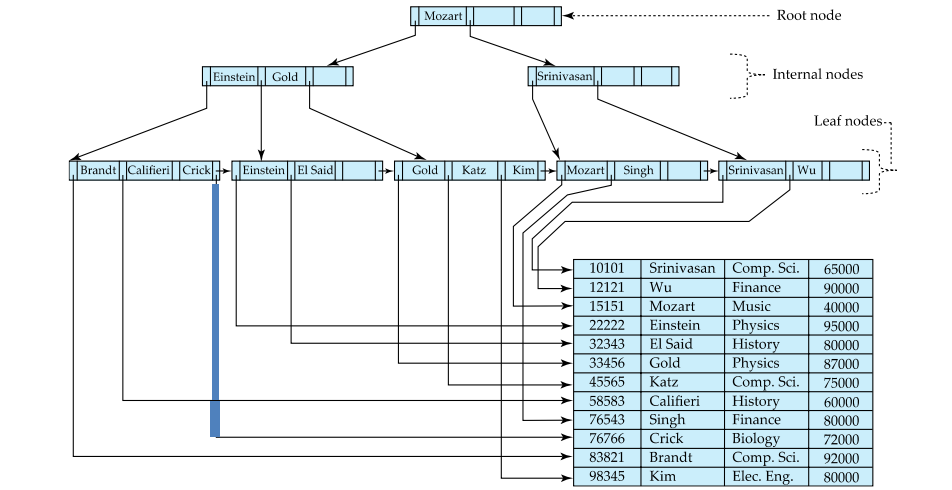

# Indexing & Hashing

## Basic Concepts

* Query
* **Indexes** (索引) are a kind of data structures for speeding up query processing
* Indexing mechanisms
  * speed up the access of desired data
  * index files are typically much smaller than the original file
* **Search Key**(搜索码/关键字)
  * The set of attributes used to look up records in a file/table
  * An index file consists of records (called index entries, 索引项) of the form (search-key, pointer)
* Two kinds of indices
  * **Ordered index** (顺序索引): search keys are stored in sorted order
  * **Hash index** (散列索引): search keys are distributed uniformly across "buckets" using a "hash function"
* Why indexes work?
  索引可提高检索效率，其结构（二叉树、B+树等）占用空间小，所以访问速度快
  * 如果表中的一条记录在磁盘上占用 1000字节，对其中10字节的一个字段建立索引，那么该记录对应的索引项的大小只有10字节。如SQL Server的最小空间分配单元是"页Page"，一个页在磁盘上占用8K空间，可以存储上述记录8条，但可以存储索引800条
  * 从一个有8000条记录表中检索符合某个条件的记录，如没有索引，可能需要遍历8000条×1000字节/8K字节=1000个页面才能找到结果。
  * 如果在检索字段上有上述索引，则可以在8000条×10字节/8K字节=10个页面中检索到满足条件的索引块（可以放在内存中），然后根据索引块上的指针逐一找到结果数据块，这样I/O访问量要少很多
* Index evaluation metrixs
  * access types supported efficiently
    * e.g. equal-query,range-query,...
  * access time
  * update time
    * insertion time
    * deletion time
  * space overhead

## Ordering Indexing

* ordered index
  * index entries are sorted on the search key value
  * primary index and secondary index
  * **Primary index (主索引), clustering index 聚集索引**
    * 包含记录的文件按某个搜索码指定的顺序排序，该搜索码对应的索引称为clustering index
  * **Secondary index (辅助索引), no-clustering index (非聚集索引)**
    * An index whose search key specifies an order different from the sequential order of the file
* Index-sequential file (索引顺序文件)
  * Ordered sequential file with a primary index
  * 索引顺序文件是顺序文件的扩展，其中各记录本身在介质上也是顺序排列的，包含了直接处理和修改记录的能力。索引顺序文件能像顺序文件一样进行快速顺序处理，既允许按物理存放次序（记录出现的次序），也允许按逻辑顺序（由记录主关键字决定的次序）进行处理。索引顺序文件通常用树结构来组织索引。静态索引结构ISAM和动态索引结构VSAM

### primary index: clustering index

* 聚集索引的叶节点就是数据节点，索引顺序就是数据物理存储顺序。一个表最多只能有一个聚集索引

### secondary index: non-clustering index

* 非聚集索引的叶节点仍然是索引节点，有一个指针指向对应的数据块。
  非聚集索引顺序与数据物理排列顺序无关

---

* dense index
  * Index record appears for every search-key value in the file
* sparse index
  * Contain index records for only some search-key values when records are sequentially ordered on search-key (why?)
* multilevel index
  * If primary index does not fit in memory, data access becomes expensive
  * To reduce the number of disk accesses to index records, treat primary index as a sequential file and construct a sparse index on it
    * outer index – a sparse index of primary index
    * inner index – the primary index file
  * If even outer index is too large to fit in main memory, yet another level of index can be created, and so on
  

### dense vs. sparse index

* to locate a record with search-key value K
  * dense
    * find index record with search-key value = K
  * sparse
    * find index record with the largest search-key value <= K
    * then search file sequentially starting at where the index points to
* index update
  * deletion
    * dense indices - similar to file record deletion
    * sparse indices
      * if an entry for the search key exists in the index, it is deleted by replacing the entry in the index with the next search-key value in the file
      * if the next search-key value already has an index entry, the entry is deleted instead of being replaced
  * insertion
    * Perform a lookup using the search-key value
    * Dense indices – if the search-key value does not appear in the index, insert it
    * Sparse indices – if index stores an entry for each block of the file, no change needs to be made to the index unless a new block is created. In this case, the first search-key value appearing in the new block is inserted into the index

* space and maintenance
  * Sparse index needs less space and less maintenance overhead for insertions and deletions
  * Good tradeoff: sparse index with an index entry for every block in file, corresponding to the least search-key value in the block

### Secondary Indices

* Querying by secondary indices
  * Example 1: In the account relation stored sequentially by account number, we may want to find all accounts in a particular branch
  * Example 2: to find all accounts with a specified balance or range of balances
* Secondary index
  * Build a secondary index with an index record for each search-key value
  * Index record points to a bucket that contains pointers to all the actual records with that particular search-key value
  

### Primary & Secondary Indices

* Secondary indices have to be **dense**
* When a file is modified, every index on the file must be updated. Updating indices imposes overhead on database modification
* Sequential scan using primary index is efficient, but a sequential scan using a secondary index is expensive
  * each record access may fetch a new block from disk

## B+-tree & B-tree Indices

* disadvantage of indexed-sequential file
  * Performance degrades as file grows, since many overflow blocks (溢出块) get created. Periodic reorganization of entire file is required

### B+-tree Index File

* B+-tree index file
  * Advantage: automatically reorganizes itself with small and local changes, in the face of insertions and deletions. Reorganization of entire file is not required to maintain performance
  * Disadvantage: extra insertion and deletion overhead, space overhead
  * B+-tree is used widely since its advantages outweight the disadvantages

  

* typical B+-tree node

  

  * $K_i$: search-key values. They are ordered in a node, i.e. $K_1<K_2<...<K_{n-1}$
  * $P_i$: pointers to children (non-leaf nodes) or pointers to records or buckets of records(leaf nodes)

* A B+-tree is a rooted tree (有根树) satisfying the following properties:
  * B+-tree is a balanced tree and all the paths from root to leaf nodes are of the same length
  * Internal node
    * Each node has between $n/2$ and $n$ children (pointers)
  * Leaf node
    * Each node has between $\lceil (n-1)/2\rceil$ and $n-1$ values
  * Root node
    * If the root is not a leaf, it has at least $2$ children
    * If the root is a leaf (i.e., there are no other nodes in the tree), it can have between $0$ and $n–1$ values

    

### Leaf Node in B+-tree

* Properties of a leaf node
  * Pointer $P_i$ either points to a file record with search-key value $K_i$, or to a bucket of pointers to file records, each record having search-key value $K_i$. Only need bucket structure if the search-key does not form a primary key
  * $P_n$ points to next leaf node in search-key order

## Static & Dynamic Hashing

## Ordered Indexing vs. Hashing

## Index Definition in SQL

## Multiple-key Access
