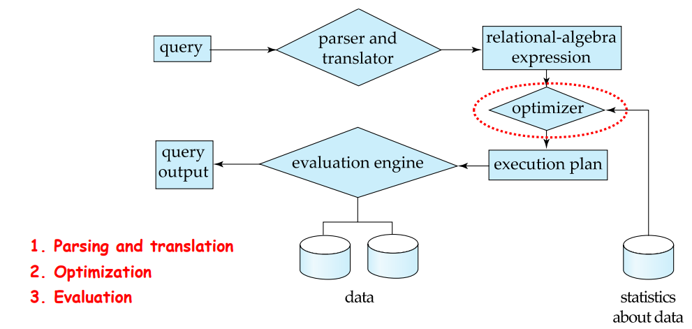

# Query Processing

## Overview

### Basic Steps in Query Processing

  

* parsing and translation
  * translate the query into the internal form which is then translated into **relational algebra**
* optimization
  * Generate the optimal execution plan (执行计划)
* execution

### Query Optimization

```sql
select salary
from instructor 
where salary <75000
```

give its relationnal algebra

$\sigma_{salary<75000}(\Pi_{salary}(instructor))$
$\Pi_{salary}(\sigma_{salary<75000}(instructor))$

* A relational algebra expression may have many equivalent expressions
* Annotated expression specifying detailed execution strategy is called an execution-plan
  * can use an index on instructor to find instructors with salary < 75000, or
  * perform complete relation scan and discard instructors with salary ≥ 75000

* query optimization
  * Amongst all equivalent evaluation plans, choose the one with lowest cost
  * Cost is estimated using statistical information from the database catalog

## Measures of Query Cost

* Cost is generally measured as total elapsed time for answering query
  * disk accesses, CPU, and even network communication
* Typically disk access is the predominant cost, and is also relatively easy to be estimated
* Disk access is measured by taking into account
  * Number of seeks
  * Number of blocks read
  * Number of blocks written
    * The cost to write a block is greater than the cost to read a block
    * Data is read back after being written to ensure that the write was successful

* For simplicity, use **the number of block transfers from disk** and **the number of seeks** as the cost measure
* Cost for 𝒃 block transfers plus 𝑺 seeks
$𝒃 ∗ 𝒕_𝑻 + 𝑺 ∗ 𝒕_𝑺$
  * $𝒕_𝑻$ : time to transfer one block, ≈0.1ms
  * $𝒕_𝑺$ : time for one seek, ≈4ms
* Cost also depends on the size of the buffer in main memory
  * Large buffer reduces the need for disk access
  * Often use worst case estimates, assuming only the minimum amount of buffer storage is available

## Seletion Operation

* **file scan**
  * Search algorithms that locate and retrieve records that satisfy a selection condition
* **Index scan**
  * search algorithms that use an index
  * selection condition must be on search-key of an index

* Algorithm A1 (linear search)
  * cost estimate = $b_r$ blocks transfers + 1 seek(前提：文件块顺序存放)
    * $b_r$: number of blocks containing records from relation r
  * if selection is on a key attribute(unique), can stop on finding record
    * average cost = $(b_r/2)$ block transfers + 1 seek
  * linear search can be applied regardless of
    * selection condition or
    * ordering of records in the file, or
    * availability of indices

* A1' (binary search)
  * Applicable if selection is an equality comparison on the attribute on which file is ordered
  * Assume that the blocks of a relation are stored contiguously
  * Cost estimate (number of disk blocks to be scanned):
    * cost of locating the first tuple by a binary search on the blocks
    * worst cost $\lceil log_2(b_r)\rceil * (t_T + t_S)$
    * If there are multiple records satisfying selection
      * Add transfer cost of the number of blocks containing records that satisfy selection condition

### Selection Using Indices

* A2 (primary index on candidate key, equality)
  * Retrieve a single record that satisfies the corresponding equality condition
  * Cost = $(h_i+1)*(t_T+t_S)$  **(B+-tree)**

* A3 (primary index on non-key, equality) Retrieve multiple records
  * Records will be on consecutive blocks
    * Let 𝑏 = number of blocks containing matching records
  * Cost = $h_i*(t_T+t_S)+t_S+t_T*b$

* A4 (equality on search-key of secondary index)
  * retrieve a single record if the search-key is a candidate key
    * cost = $(h_i+1)*(t_T+t_S)$
  * retrieve multiple records if search-key is not a candidate key
    * assume that n records satisfy
    * cost = $(h_i+n)*(t_T+t_S)$
      * can be expensive
    * each record may be on a different block
      * one block access for each retrieved record

### Selection Involving Comparisons

* Implement selections of the form $\sigma_{A\geq V}(r)$ or $\sigma_{A\leq V}(r)$ by
  * using a linear file scan or binary search, or
  * using indices in the following ways:

* A5 (primary index, comparison)
  * relation is sorted on A
  * for $\sigma_{A\geq V}(r)$ use index to find first tuple $\geq$ V and scan relation sequentially from there
  * for $\sigma_{A\leq V}(r)$ just scan relation sequentially till first tuple > V, do not use index

* A6 (secondary index, comparison)
  * for $\sigma_{A\geq V}(r)$ use index to find first index entry $geq$ V and scan **index** sequentially to find pointers to records wanted
  * for $\sigma_{A\leq V}(r)$ just scan **leaf pages of index** till first entry > V
  * In either case, retrieve records that are pointed to
    * requires an **I/O** for each record
    * Linear file scan may be cheaper if many records are to be fetched!
  
---

### Selection Operation Cost Estimation


---

### Implementation of Complex Selections

* conjunction(合取): $\sigma_{\theta_1\wedge\theta_2\wedge\cdots\wedge\theta_n}(r)$
* A7 (conjunctive selection using one index)
  * Select a condition of 𝜽𝒊 and algorithms A1 through A6 that results in the least cost for $\sigma_{\theta_i}(r)$
  * Test other conditions on the tuples after fetching them into memory buffer
* A8 (conjunctive selection using multiple-key index)
  * Use appropriate composite (multiple-key) index if available
* A9 (conjunctive selection by intersection of identifiers)
  * Requires indices with record pointers
  * Use corresponding index for each condition, and take intersection of all the obtained sets of record pointers
  * Then fetch records from file

* disjunction (析取): $\sigma_{\theta_1\vee\theta_2\vee\cdots\vee\theta_n}(r)$
* A10 (disjunctive selection by union of identifiers).
  * Applicable if all conditions have available indices
* Otherwise use linear scan
  * Use the corresponding index for each condition, and take union of all the obtained sets of record pointers.
  * Then fetch records from file
* negation (取反): $\sigma_{\urcorner\theta}(r)$
  * Use linear scan on file
  * If very few records satisfy $\urcorner\theta$, and an index is applicable to $\theta$
    * Find satisfying records using index and fetch from file

## Sorting

* We can build an index on the relation, and then use the index to read the relation in sorted order.
* May lead to one disk block access for each tuple (for non-primary indices)
* Relations that fit in memory
  * Techniques like quick-sort (快速排序) can be used
* Relations that don’t fit in memory
  * External sort-merge (外部排序归并) is a good choice

* 插入排序、选择排序、冒泡排序、快速排序、堆排序、归并排
  序、希尔排序、二叉树排序、计数排序、桶排序、基数排序…

* 不稳定
  * 选择排序（selection sort）: $O(n^2)$
  * 快速排序（quicksort）: $O(nlogn)$ 平均时间, $O(n^2)$ 最坏情况; 对于大的
、乱序串列一般认为是最快的已知排序
  * 堆排序 （heapsort）: $O(nlogn)$
  * 希尔排序 （shell sort）: $O(nlogn)$
  * 基数排序（radix sort）: $O(n·k)$; 需要 $O(n)$ 额外存储空间 （K为特征个
数）

* 稳定
  * 插入排序（insertion sort）: $O(n^2)$
  * 冒泡排序（bubble sort）: $O(n^2)$
  * 归并排序 （merge sort）: $O(nlogn)$; 需要 $O(n)$ 额外存储空间
  * 二叉树排序（Binary tree sort）: $O(nlogn)$; 需要 $O(n)$ 额外存储空间
  * 计数排序 (counting sort) : $O(n+k)$; 需要 $O(n+k)$ 额外存储空间，k为序列中Max-Min+1
  * 桶排序 （bucket sort）: $O(n)$; 需要 $O(k)$ 额外存储空间

### External Sort-Merge (外部排序归并)

* relations that don't fit in memory
* Let M denote memory buffer size (in blocks)
* Create sorted runs (归并段)
  let 𝒊 = 𝟎 initially
  repeatedly do the following till the end of the relation:
  * read M blocks of relation into memory
    sort the in-memory blocks
    write sorted data to run 𝑹𝒊
    increment 𝒊

  let the final value of 𝒊 = 𝑵 (N-way merge)
* Merge the runs (next slide)

## Join Operation

* examples using following information
  * #records
    * customer:10000
    * depositor:5000
  * #blocks
    * customer:400
    * depositor:100

### Nested-Loop Join (嵌套循环连接)

* compute the theta join $r\bowtie_\theta S$

  ```c
  for each tuple 𝑡𝑟 in 𝑟 do begin
    for each tuple 𝑡𝑠 in 𝑠 do begin
      test pair (𝑡𝑟, 𝑡𝑠) to see if they satisfy the join condition 𝜃
        if they do, add 𝑡𝑟 ∙ 𝑡𝑠 to the result.
    end
  end
  ```

* 𝒓 is called the outer relation (外层关系) and 𝒔 is called the inner relation (内层关系)
* Require no indices and can be used for any kind of join condition
* Expensive since it examines every pair of tuples in the two relations
* In the worst case, if there is enough memory only to hold one block of each relation, the estimated cost is $n_r*b_s+b_r$ block transfers, plus $n_r + b_r$ seeks (𝒓:outer relation (外层关系) 𝒔: inner relation (内层关系) )
* If two or the smaller relation(s) fit(s) entirely in memory, use that as the inner relation.
  * Reduces cost to br + bs block transfers and 2 seeks
* **Block nested-loops algorithm** is preferable
* 较小的关系做内层更优

### Block Nested-Loop Join (块嵌套循环连接)

* Variant of nested-loop join in which every block of inner relation is paired with every block of outer relation.

```c
for each block 𝐵𝑟 of 𝑟 do begin
  for each block 𝐵𝑠 of 𝑠 do begin
    for each tuple 𝑡𝑟 in 𝐵𝑟 do begin
      for each tuple 𝑡𝑠 in 𝐵𝑠 do begin
        check if (𝑡𝑟, 𝑡𝑠) satisfy the join condition 
        if they do, add 𝑡𝑟 ∙ 𝑡𝑠 to the result.
      end
    end
  end
end
```
